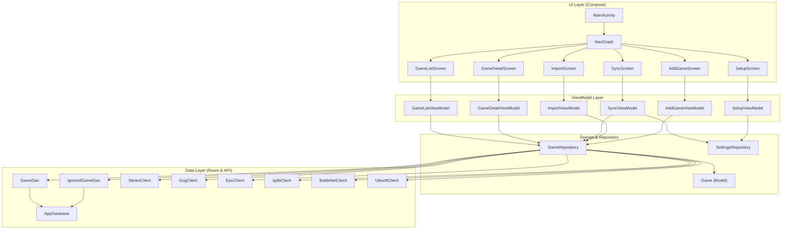

# Project Overview: PC Game Collection

The PC Game Collection is an Android application designed to centralize and visualize your PC game collection from multiple sources (Steam, GOG, Epic Games, Ubisoft, Battle.net) in a modern, cover-based UI.

## Architecture

The project follows the **MVVM (Model-View-ViewModel)** architectural pattern, adhering to modern Android development best practices.

- **UI Layer (Jetpack Compose):** A declarative UI built with Jetpack Compose. Screens are responsible for rendering the state and delegating user actions to ViewModels.
- **ViewModel Layer:** Manages screen-specific state and business logic. ViewModels communicate with repositories to fetch or update data.
- **Domain Layer:** Contains data models (`Game`, `IgnoredGame`) and business logic encapsulated in Repositories.
- **Data Layer:** 
    - **Room Database:** Local persistence for games and ignore lists. Provided via a singleton pattern in the `MainApp` class.
    - **API Clients:** Ktor-based clients for interacting with external game store APIs and IGDB for metadata enrichment.
- **Dependency Injection:** Currently implemented manually in `MainActivity`, where repositories and API clients are instantiated and passed down to ViewModels via factories (or directly in this simplified implementation).

## Core Components

### Screens
- **GameListScreen:** The main dashboard showing the game library with support for filtering, sorting, and grouping.
- **GameDetailScreen:** Provides in-depth information about a specific game, including screenshots, summary, and playtime per platform.
- **SyncScreen:** Orchestrates the synchronization process for multiple game launchers.
- **ImportScreen:** Allows importing collection data via JSON or Playnite exports.
- **AddGameScreen:** Enables manual searching and adding of games via the IGDB database.
- **SetupScreen:** Initial configuration screen for API keys and account settings.

### Database Models
- **`Game`**: The central entity representing a game. It stores metadata (title, summary, release date, ratings) and source-specific data (IDs and playtime for each platform).
- **`IgnoredGame`**: Stores games that the user has chosen to exclude from their collection to prevent them from reappearing during synchronization.

### Repositories
- **`GameRepository`**: The central hub for data operations. It coordinates between the local database and various API clients. Key features include:
    - **Synchronization:** Multi-launcher sync logic (Steam, GOG, Epic, etc.) with fuzzy title matching and ID resolution via IGDB.
    - **Metadata Enrichment:** Automatically fetches screenshots, summaries, and ratings from IGDB.
    - **Deduplication:** Uses IGDB IDs as a "Master ID" to merge entries from different stores into a single game entry.
- **`SettingsRepository`**: Manages application settings, API keys, and account credentials using `DataStore`.

### ViewModels
- **`GameListViewModel`**: Handles library state, multi-selection, filtering logic, and metadata enrichment triggers.
- **`SyncViewModel`**: Manages the complex multi-step synchronization flow across different APIs.
- **`GameDetailViewModel`**: Manages the state for the detail view and individual game updates.
- **`ImportViewModel`**: Manages the logic for importing collection data from external files.
- **`AddGameViewModel`**: Orchestrates manual game searches and metadata pre-fetching.
- **`SetupViewModel`**: Handles the initial user configuration and API validation.

## Dependency Chart

The following diagram visualizes the relationships between the most important classes and functions:

